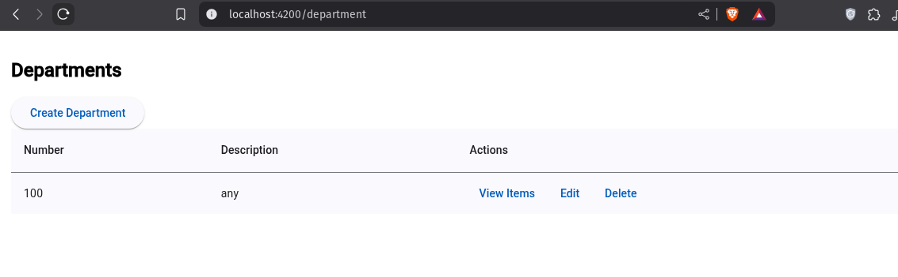
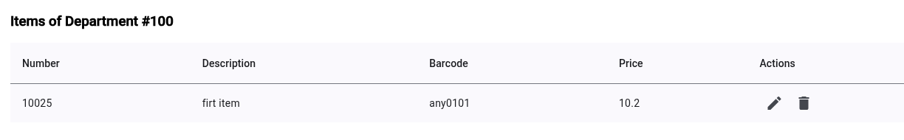
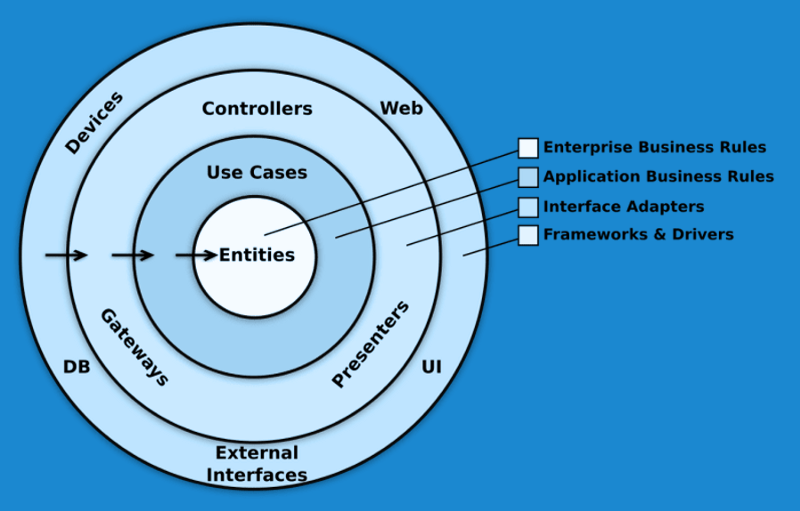

# DepartmentCrud

## UI (Interfaces)
- `Department` :

- `Items from Department` :


# ✅ Recommendations

## 1. 🧼 Use Clean Architecture

- Clearly separate responsibilities:  
  - `Core`: services, interceptors, guards, and pure models  
  - `Domain`: interfaces and business logic  
  - `Application`: use cases and validations  
  - `Infrastructure`: API services, persistence, and utilities  
  - `UI`: components and pages  

> Business logic should not depend on Angular itself.



---

## 2. 📦 Feature-Based Project Structure

Organize the app by business domain. Example:  
`src/app/features/orders`, `src/app/features/products`, `src/app/shared`, `src/app/core`

- Use lazy loading for each feature module  
- Avoid global barrel files (`index.ts`) inside features; use them only in `shared`

---

## 3. 📊 State Management with NgRx

- Follow Redux principles:  
  - `Actions`  
  - `Reducers`  
  - `Selectors`  
  - `Effects`

Each feature should contain a `+state` directory:  
Example:  
`+state/products.actions.ts`, `products.reducer.ts`, `products.effects.ts`, `products.selectors.ts`

**Best Practices:**

- Use `@ngrx/component-store` for local state in components  
- Do not store unnecessary data in the global store  
- Use `createFeature`, `createActionGroup`, and `createReducer` for clarity and type safety  
- Create reusable and composed selectors

---

## 4. ⚙️ Reactive Programming with RxJS

**Best Practices:**

- Prefer `async` pipe over manual `subscribe`  
- Always handle errors using `catchError`  
- Use `takeUntil` with a `destroy$` subject to prevent memory leaks  
- Use `switchMap` to cancel previous requests  
- Avoid deeply nested observables; keep streams flat

---

## 5. 🧩 Microfrontends and Shared Libraries

- Angular supports Microfrontends using Module Federation with Webpack 5  
- Use independent deployable modules if scalability or team autonomy is required  
- Create shared libraries to avoid duplication (components, models, services)  
- Place them in `libs/` or `projects/`  
- Use tools like `nx`, `lerna`, or Angular CLI workspaces to manage libraries

---

## 6. 🧪 Testing

- Use `Jest` or `Karma` for unit tests  
- Use `Cypress` or `Playwright` for end-to-end tests  
- Follow the testing pyramid: more unit tests, fewer E2E and integration tests  
- Mock external services with `HttpTestingController` or `MockStore`  
- Write tests for selectors, reducers, and effects separately

---

## 7. ✨ Additional Best Practices

- Prefer `Standalone Components` to reduce boilerplate  
- Use the SCAM pattern (Single Component Angular Module) when needed  
- Enable `strict` mode in `tsconfig.json`  
- Use interceptors for global HTTP logic (auth, logging, errors)  
- Avoid hardcoded strings; use enums or constants  
- Enforce consistency with ESLint and Prettier  
- Follow accessibility standards (a11y) and semantic HTML  
- Keep dependencies updated and perform regular security scans (`npm audit`, `Snyk`, OWASP tools)

---

This project was generated using [Angular CLI](https://github.com/angular/angular-cli) version 20.0.0-next.9.
## Development server

To start a local development server, run:

```bash
ng serve
```

Once the server is running, open your browser and navigate to `http://localhost:4200/`. The application will automatically reload whenever you modify any of the source files.


## Building

To build the project run:

```bash
ng build
```

This will compile your project and store the build artifacts in the `dist/` directory. By default, the production build optimizes your application for performance and speed.
